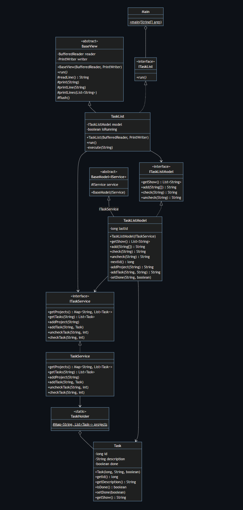

# SA2024
HW1 資工碩一 王衍斌 112598041 

## Layers from high to low
| class         | function                              |
| ------------- | ------------------------------------- |
| Const         | singleton to get the various messages |
| Task          | data structure                        |
| TaskHolder    | singleton that have task instances    |
| TaskService   | access TaskHolder only                |
| TaskListModel | business logics                       |
| TaskList      | read and print                        |
| Main          | main class                            |

## Abstract Classes and Interfaces
| class          | function                                                   |
| -------------- | ---------------------------------------------------------- |
| ITaskService   | interface of TaskService for DIP                           |
| ITaskListModel | interface of TaskListModel for DIP                         |
| ITaskList      | interface of TaskList for DIP                                                        |
| BaseView       | command-based view that provide printline and readline etc |
| BaseModel      | recive service interface and stored it                     |

## Problems of HW1
- every interfaces are not doing the DIP
- the higher layer still directly access the lower layer
    - e.g. ```TaskListModel``` access the method ```printLine``` of ```BaseView```


## Class Diagram


