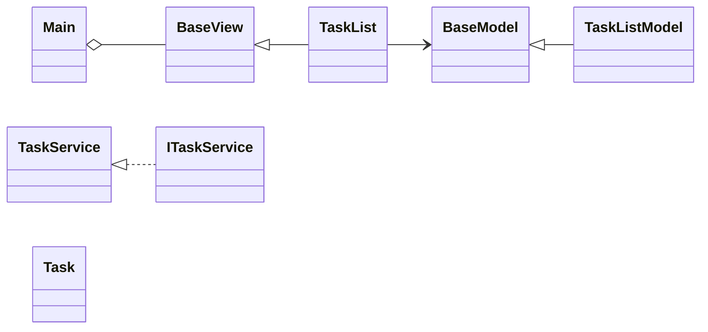
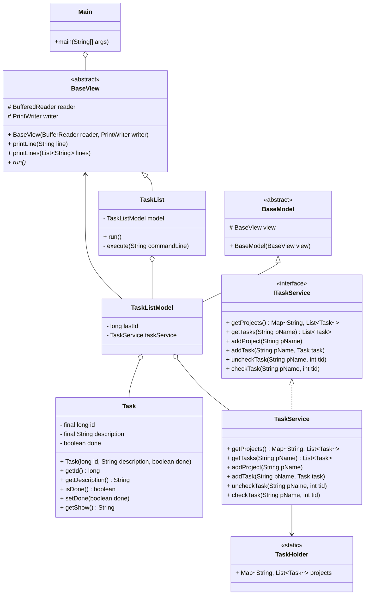

# SA2024
HW1 資工碩一 王衍斌 112598041 

- return value instead of calling the method of BaseView 


# HW1
## Layers from high to low
| class         | function                  |
| ------------- | ------------------------- |
| Task          | data structure            |
| TaskHolder    | singleton that have tasks |
| TaskService   | access TaskHolder only    |
| TaskListModel | business logics           |
| TaskList      | read and print            |
| Main          | runable                   |

## Problems
- every interfaces are not doing the DIP
- the higher layer still directly access the lower layer
    - e.g. ```TaskListModel``` access the method ```printLine``` of ```BaseView```




ideas
- TaskList: read and write for client
- TaskListModel: logic for TaskList
- TaskService: interface for accessing the data
- TaskHolder: singleton
