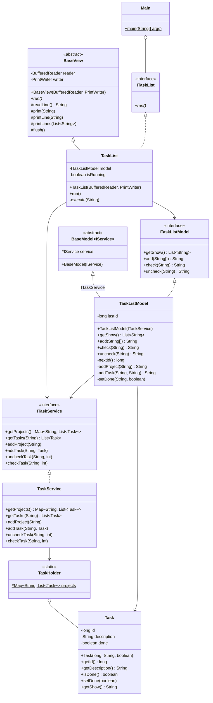
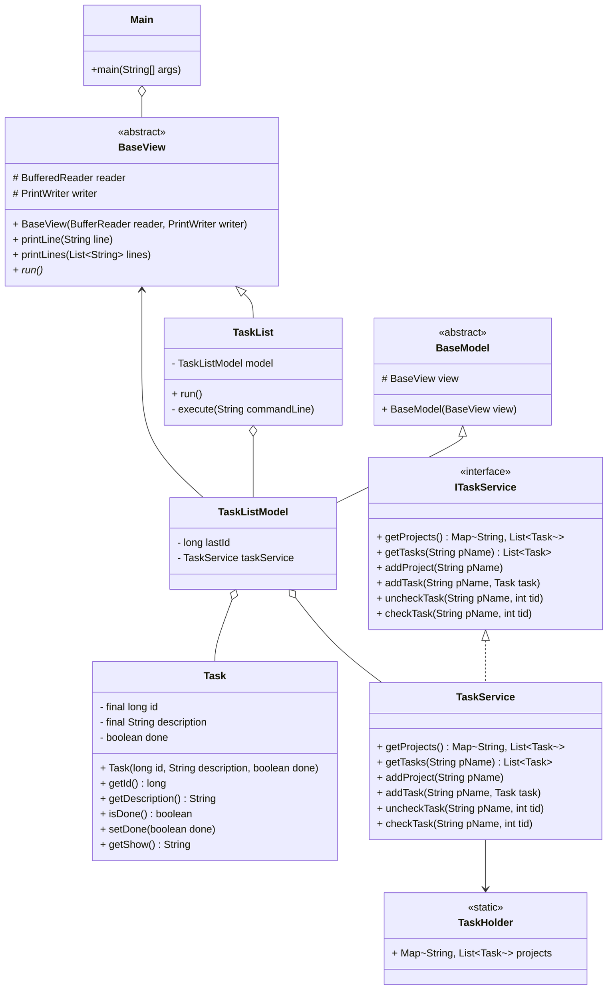

# SA2024
HW1 資工碩一 王衍斌 112598041 

## Layers from high to low
| class         | function                  |
| ------------- | ------------------------- |
| Task          | data structure            |
| TaskHolder    | singleton that have tasks |
| TaskService   | access TaskHolder only    |
| TaskListModel | business logics           |
| TaskList      | read and print            |
| Main          | main class                |

## Abstract Classes and Interfaces
| class          | function                                               |
| -------------- | ------------------------------------------------------ |
| ITaskService   | DIP                                                    |
| ITaskListModel | DIP                                                    |
| ITaskList      | DIP                                                    |
| BaseView       | command-based view that provide printline and readline |
| BaseModel      | recive service interface and stored it                 |


## Class Diagram



# HW1 Review
## Layers from high to low
| class         | function                  |
| ------------- | ------------------------- |
| Task          | data structure            |
| TaskHolder    | singleton that have tasks |
| TaskService   | access TaskHolder only    |
| TaskListModel | business logics           |
| TaskList      | read and print            |
| Main          | runable                   |

## Problems
- every interfaces are not doing the DIP
- the higher layer still directly access the lower layer
    - e.g. ```TaskListModel``` access the method ```printLine``` of ```BaseView```




ideas
- TaskList: read and write for client
- TaskListModel: logic for TaskList
- TaskService: interface for accessing the data
- TaskHolder: singleton
